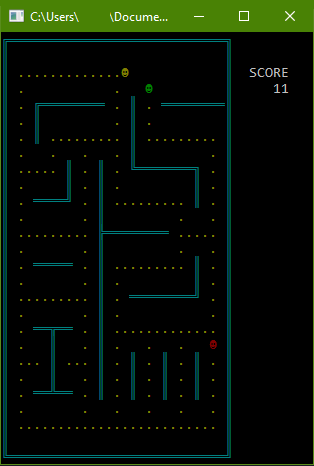

# Pacman
Terminal-based implementation of Pacman built using ncurses and extended ASCII characters only. Maps are loaded from the tile-map text files in bin/maps. (Class assignment for Computer Architecture, Spring 2015)

## Screenshot

